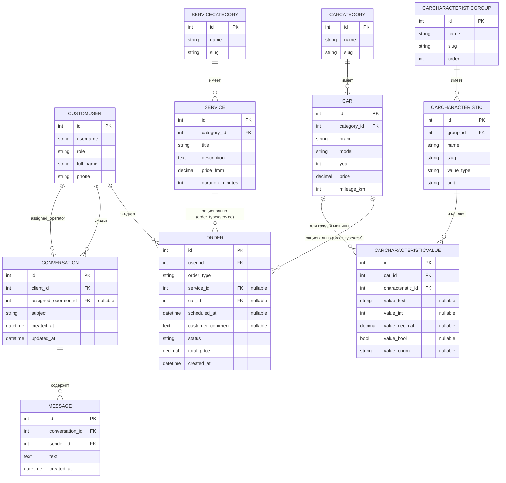

# ERD (схема данных)

```mermaid
erDiagram
    CUSTOMUSER ||--o{ ORDER : "создает"
    SERVICECATEGORY ||--o{ SERVICE : "имеет"
    CARCATEGORY ||--o{ CAR : "имеет"
    SERVICE ||--o{ ORDER : "опционально (order_type=service)"
    CAR ||--o{ ORDER : "опционально (order_type=car)"

    CUSTOMUSER ||--o{ CONVERSATION : "клиент"
    CUSTOMUSER ||--o{ CONVERSATION : "assigned_operator"
    CONVERSATION ||--o{ MESSAGE : "содержит"

    CUSTOMUSER {
        int id PK
        string username
        string role
        string full_name
        string phone
    }

    SERVICECATEGORY {
        int id PK
        string name
        string slug
    }

    SERVICE {
        int id PK
        int category_id FK
        string title
        text description
        decimal price_from
        int duration_minutes
    }

    CARCATEGORY {
        int id PK
        string name
        string slug
    }

    CAR {
        int id PK
        int category_id FK
        string brand
        string model
        int year
        decimal price
        int mileage_km
    }

    CARCHARACTERISTICGROUP ||--o{ CARCHARACTERISTIC : "имеет"
    CARCHARACTERISTIC ||--o{ CARCHARACTERISTICVALUE : "значения"
    CAR ||--o{ CARCHARACTERISTICVALUE : "для каждой машины"

    CARCHARACTERISTICGROUP {
        int id PK
        string name
        string slug
        int order
    }

    CARCHARACTERISTIC {
        int id PK
        int group_id FK
        string name
        string slug
        string value_type
        string unit
    }

    CARCHARACTERISTICVALUE {
        int id PK
        int car_id FK
        int characteristic_id FK
        string value_text "nullable"
        int value_int "nullable"
        decimal value_decimal "nullable"
        bool value_bool "nullable"
        string value_enum "nullable"
    }

    ORDER {
        int id PK
        int user_id FK
        string order_type
        int service_id FK "nullable"
        int car_id FK "nullable"
        datetime scheduled_at "nullable"
        text customer_comment "nullable"
        string status
        decimal total_price
        datetime created_at
    }

    CONVERSATION {
        int id PK
        int client_id FK
        int assigned_operator_id FK "nullable"
        string subject
        datetime created_at
        datetime updated_at
    }

    MESSAGE {
        int id PK
        int conversation_id FK
        int sender_id FK
        text text
        datetime created_at
    }
```

